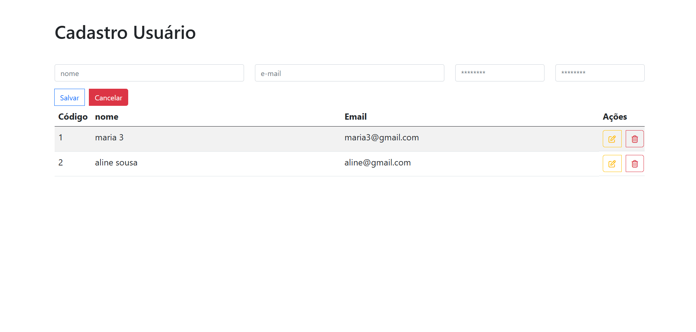
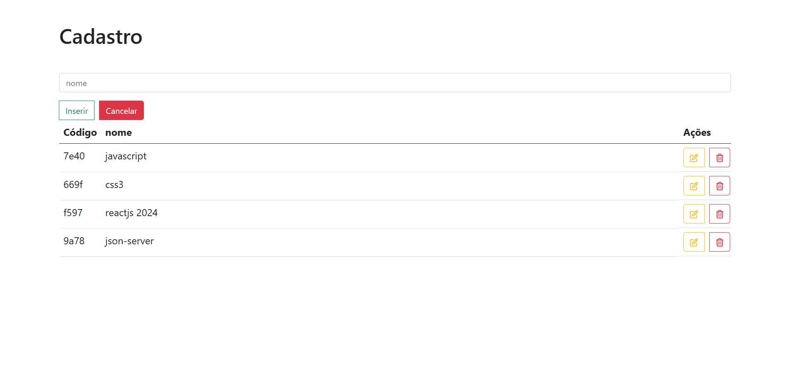

### Crud Completo React + JSON

#### Telas prontas




#### Criando projeto

* Criando com vite
```
npm create vite@latest projet
```

* CDN para colocar ono index.html
```
<link href="https://cdn.jsdelivr.net/npm/bootstrap@5.0.2/dist/css/bootstrap.min.css">
```

* Icones
```
https://fontawesome.com
```

* Link
```
<link rel="stylesheet" href="https://cdnjs.cloudflare.com/ajax/libs/font-awesome/6.5.1/css/all.min.css" />
```

* Instalar o servidor
```
npm i json-server
```

* tabelas criadas

* banco.json
```
{
  "categoria": [
    {
      "id": "7e40",
      "nome": "javascript"
    },
    {
      "id": "669f",
      "nome": "css3"
    }
  ],
  "cadastrar_user": [
    {
      "nome": "maria 3",
      "email": "maria3@gmail.com",
      "senha": "123123",
      "id": "1"
    },
    {
      "nome": "aline sousa",
      "email": "aline@gmail.com",
      "senha": "123456",
      "id": "2"
    }
  ]
}
```

* configurar o package.json
```
"scripts": {
    "dev": "vite",
    "api": "npx json-server ./src/banco.json",
    "build": "vite build",
    "lint": "eslint . --ext js,jsx --report-unused-disable-directives --max-warnings 0",
    "preview": "vite preview"
  },
```

#### Rodar o banco
```
npm run api
```

#### Rodar o projeto
```
npm run dev
```

#### Outro assunto
https://github.com/srodrigo28/crud-react/blob/main/crud-js/src/views/Investidor/index.jsx